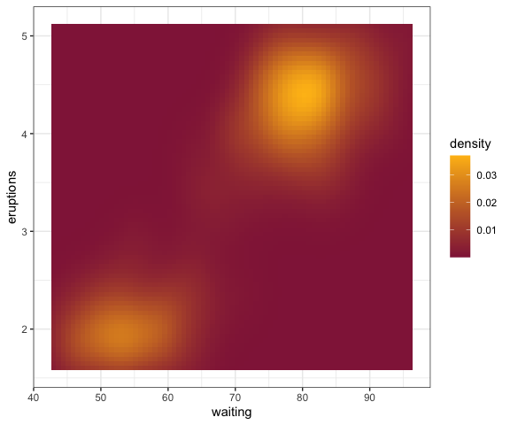

<!-- badges: start -->

[](https://www.repostatus.org/#active)
<!-- badges: end -->

# `ggluc`

An `R` package with Loyola University Chicago `ggplot2` colors and
theme.

## Set up

-   Install

``` r
# install.packages("devtools")
devtools::install_github("qntkhvn/ggluc")
```

-   Load

``` r
library(ggluc)
```

## Examples

``` r
library(ggplot2)
```

-   Scatterplot

``` r
ggplot(mtcars, aes(hp, mpg, color = mpg)) +
  geom_point(size = 4) +
  scale_color_luc_c(reverse = TRUE) +
  theme_bw()
```


-   2D density plot

``` r
ggplot(faithfuld, aes(waiting, eruptions, fill = density)) +
  geom_tile() +
  scale_fill_luc_c() +
  theme_bw()
```


